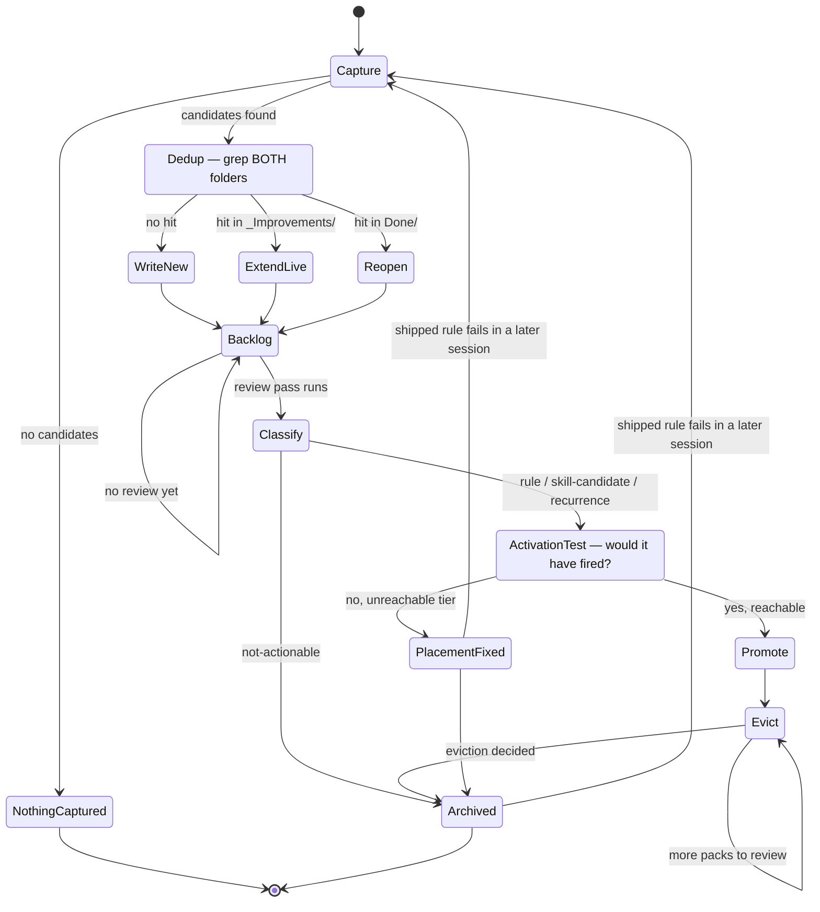

# Flow: improvement-pipeline

**Members:** `improvement-extraction`, `baseline-gap-review`
**Entry:** `Capture` · **Terminals:** `NothingCaptured`, `Archived`, `PlacementFixed`

How a lesson gets from a session into an always-on pack — and, when the resulting rule fails
anyway, how that failure gets back in. The loop is the reason this is a flow and not two
independent skills.

## The graph (normative)



The edge that matters is **`Archived → Capture`**. Everything else is a pipeline; that edge is what
makes it a loop, and it is the one nothing in the toolkit represented before.

## States and guards

| State | Owner | Guard to leave |
|---|---|---|
| `Capture` | `improvement-extraction` | A candidate is load-bearing: it would have prevented a real, dated failure. |
| `Dedup` | `improvement-extraction` | Grepped **both** `IMPROVEMENTS_ROOT` **and** `Done/`. Filename skim does not satisfy this. |
| `Reopen` | `improvement-extraction` | Two writes done: "Seen again" on the archived note **and** a live `reopened-*.md`. One write alone does not leave this state — `baseline-gap-review` never reads `Done/`. |
| `Backlog` | — | Self-loops until a review pass runs. Not a failure; the cadence is manual and may be weeks. |
| `Classify` | `baseline-gap-review` | Every note in exactly one bucket, recurrences routed to `ActivationTest`, never treated as new rules. |
| `ActivationTest` | `baseline-gap-review` | Both questions answered in writing: what dated failure would this have prevented, and would it have fired given where the pack is *actually* installed. |
| `Promote` | `baseline-gap-review` | Provenance stamped (`_(added YYYY-MM-DD, from note-slug)_`); `pack.json` version and all three adapter blocks updated together. |
| `Evict` | `baseline-gap-review` | Something removed, or an explicit "nothing evicted this round" with a reason. Silence is not an exit. |

### The trap this graph exists to prevent

`ActivationTest → PlacementFixed` is the path that keeps getting missed. When a recurrence arrives,
the instinct is to reword the rule. But a rule that failed because it was installed nowhere the
work happens is **not improved by rephrasing** — rewording looks like progress and changes nothing.
There is deliberately **no `Reopen → Promote` edge**: a recurrence cannot become a new rule without
passing the activation test first.

## Exit log

On reaching a terminal state, emit one line. This is the flow's only output that produces data
rather than prose:

```
flow=improvement-pipeline terminal=<NothingCaptured|Archived|PlacementFixed>
  captured=<n> extended=<n> reopened=<n> promoted=<n> evicted=<n>
  evict_loops=<n> blocked_guard=<state|none>
```

Append to `$IMPROVEMENTS_ROOT/.flow-log`. Check it against the graph: was the terminal a declared
one, was every transition legal, did `Evict` exit on its stated condition.

**Why this line is the point.** `reopened=` counting up over time means shipped rules keep failing —
an activation problem, not an authoring one. `evicted=0` across many runs means the pack budget is
only growing. Neither question is answerable today.

## Known gap

A flow is a declaration; something has to read it. Today that is the entry skill linking here and a
human checking the log — there is no runner, deliberately (`process-vs-work-doctrine` rule 3: this
is occurrence #2, minimal form until a third). **The honest risk is that this file goes the way of
an uninstalled baseline: correct, and inert.** The mitigation is that the exit log makes its absence
visible — no log means the flow was not followed, which is itself the measurement.
